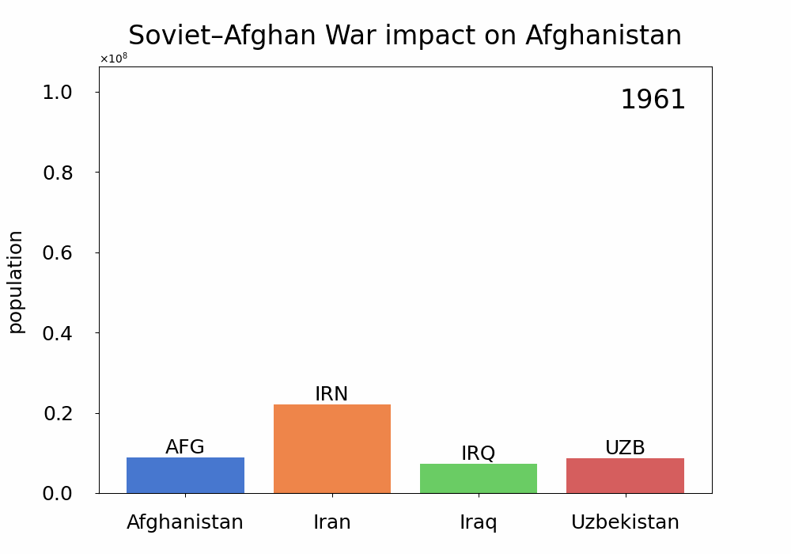

# World population animated vizualizations

Plots were made in Python with matplotlib animation and stored in a GIF format. Scipts producing the plots can be found in **scripts** directory. Data preparation was done with pandas in **filter_data.py**. For comparison of the plots see the **summary.md**.

Types of plots:
- bar (colored),
- bar (patterned),
- line,
- bubble,
- pie.

Each type of plot was prepared for:
- 5 most populated countries,
- 5 closely populated countries,
- Poland and 4 closely populated countries.

Bonus bar plot showing the impact of **Soviet-Afghan War** on the population of Afghanistan in comparison to the other countires of the region. The plot is produced by **change.py**.

  

